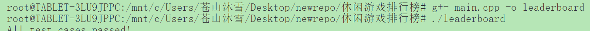
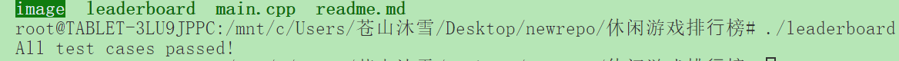

排行榜系统中的分数筛选算法实现与分析

#### 背景
在开发的手机游戏“星际泡泡龙”中，玩家通过消除彩色泡泡获得分数。为了激励玩家，游戏结束后需要展示实时更新的排行榜，显示得分最高的玩家。这个报告涵盖了从需求分析到代码实现及其性能分析。

#### 要求
我们需要一个函数 `GetTopScores` 来处理和筛选分数。其要求如下：
1. 接收两个参数：
   - `scores`：所有玩家的分数数组（正整数且不重复）。
   - `m`：需要获取的前 `m` 名最高分数。
2. 返回一个按从高到低顺序排列的前 `m` 个分数的列表。
3. 需要考虑边界情况，如空数组或 `m` 超过分数数组长度。
4. 实现单元测试来验证函数的正确性。
5. 对算法的时间复杂度进行分析。

#### 代码实现与单元测试，见 `main.cpp` 文件。

#### 边界情况处理
1. 如果 `scores` 是空的，或者 `m <= 0`，返回空的分数列表。
2. 如果 `m` 大于分数的数量，返回尽可能多的分数。

#### 时间复杂度分析
1. 排序
   - 代码中使用了 `std::sort` 函数，它的时间复杂度为 `O(n log n)`，其中 `n` 是分数数组的长度。
2. 筛选前 `m` 个最高分
   - 筛选操作是一个常数时间操作 `O(m)`，其中 `m` 是要获取的分数数量。

因此，该算法的整体时间复杂度为 `O(n log n)`，排序操作占据了主要时间成本。

#### 优化思路
在处理这种筛选问题时，尽管排序可以满足大多数需求，但如果分数数据量很大（例如百万级别的玩家分数），我们可以考虑用堆数据结构来优化筛选前 `m` 个元素的问题。利用最小堆的方式，时间复杂度可以降低为 `O(n log m)`，适用于更大的数据规模。

#### 运行结果

