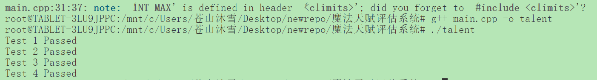

### 任务描述
在“魔法师学院”手游中，我们需要计算学徒在两种魔法属性（火系与冰系）上的综合天赋指数，方法是找出两组已排序能力值合并后的中位数。我们可以设计一个高效的算法来解决这个问题，尽量减少时间和空间复杂度。

### 重述
我们有两个有序数组 A 和 B，目标是找到这两个数组合并后的中位数。为了避免直接合并，使用二分查找，在较短的数组上寻找合适的划分点，满足条件后直接计算中位数。

### 中位数的定义
如果总数为奇数，中位数就是合并后数组的第 (m+n)/2 个元素。
如果总数为偶数，中位数是合并后数组的第 (m+n)/2 和 (m+n)/2+1 个元素的平均值。

### 二分查找
不必真的合并两个数组。可以利用数组的有序性，只需要找到一个合适的划分点，

左半部分的所有元素小于或等于右半部分的所有元素。
左半部分包含 (m+n+1)/2 个元素。

- 假设把 A 和 B 数组划分为两部分：

左半部分由 A 的前部分和 B 的前部分构成。
右半部分由 A 的后部分和 B 的后部分构成。

假设在 A 中有 partitionA 个元素划分到左半部分，在 B 中有 partitionB = (m + n + 1) / 2 - partitionA 个元素划分到左半部分。这样左右部分的总元素数量就平衡了。

- 划分是有效的前提条件：

A 左半部分的最大元素 maxLeftA 必须小于等于 B 右半部分的最小元素 minRightB。
B 左半部分的最大元素 maxLeftB 必须小于等于 A 右半部分的最小元素 minRightA。

maxLeftA <= minRightB
maxLeftB <= minRightA

- 调整划分点：

如果 maxLeftA > minRightB，说明 A 的划分点 partitionA 太大了，应该向左移动，即 high = partitionA - 1。
如果 maxLeftB > minRightA，说明 A 的划分点 partitionA 太小了，应该向右移动，即 low = partitionA + 1。

- 运行结果

### 实时更新大量学徒天赋指数的优化方法
使用两个堆（最大堆和最小堆）来分别存储两部分数据。这样，当有新的能力值加入时，可以通过调整这两个堆的大小来保证平衡，并通过堆顶的元素直接计算中位数。

### 扩展到处理k个有序数组的中位数
多路归并，通过优先队列（堆）逐步合并k个有序数组，保持数组有序，最终可以找到中位数。

### 天赋评估系统对角色发展和技能学习的影响
角色发展，技能加点，再影响团队中的定位，提升游戏的体验