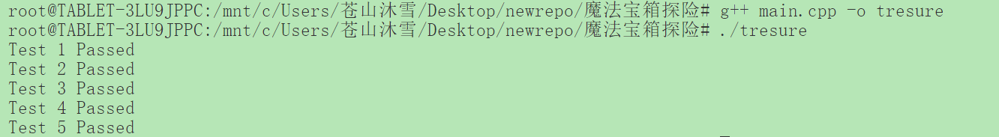

###  魔法宝箱探险

#### 做法一
这可以当做一个状态机模型下的dp来做，定义状态f[i][0]和f[i][1]，前者代表目前这个第i次可以开箱，后者表示这第i次没有资格可以开箱。
f[i][0] = max(f[i - 1][0], f[i - 1][1])
f[i][1] = f[i - 1][0] + treasures[i]

#### 做法二
其实还可以有更直观的做法
我们可以定义一个状态 f[i]，表示前 i 个宝箱的最大价值。在这种模型中，我们可以有两种选择：

不打开第 i 个宝箱：在这种情况下，最大价值等于前 i-1 个宝箱的最大价值，即 f[i-1]。
打开第 i 个宝箱：在这种情况下，最大价值为第 i 个宝箱的价值加上前 i-2 个宝箱的最大价值（因为不能打开相邻的宝箱），即 treasures[i] + f[i-2]。

f[i]=max(f[i−1],treasures[i]+f[i−2])

### 复杂度分析
时间复杂度: O(n)，其中 n 是宝箱的数量。我们只需遍历一次宝箱列表。

空间复杂度: O(n)，由于使用了动态规划数组 dp 来存储中间结果。可以进一步优化为 O(1) 的空间，使用两个变量来保存前两个状态。

### 运行结果



### 允许使用一次“魔法钥匙”打开相邻宝箱
我的思路是在我的做法二中再添加一个状态，表示玩家是否已经使用了魔法钥匙。如果玩家使用了魔法钥匙，则可以打开相邻的宝箱，否则不能。

我们需要在状态转移中引入一个新状态来表示玩家是否已经使用了魔法钥匙。我们可以定义状态f[i][0] 和f[i][1]为未使用魔法钥匙和已使用魔法钥匙的情况。

 状态定义

- f[i][0] 表示在考虑第 i 个宝箱时，未使用魔法钥匙的情况下获得的最大价值。
-  f[i][1] 表示在考虑第i个宝箱时，已经使用魔法钥匙的情况下获得的最大价值。

#### 状态转移方程

1. 未使用魔法钥匙
   - f[i][0] = max(f[i - 1][0], f[i - 1][1]) 
   - f[i][0] = max(f[i][0], f[i - 1][1] + treasures[i])

2. 已使用魔法钥匙
   - f[i][1] = max(f[i - 1][1], f[i - 1][0]) 
   - f[i][1] = max(f[i][1], f[i - 1][0] + treasures[i]) 


```cpp
// 初始化第一个宝箱的状态
f[0][0] = 0;              // 不打开
f[0][1] = treasures[0];  // 打开

// 状态转移
for (int i = 1; i < n; ++i) {
    f[i][0] = std::max(f[i - 1][0], f[i - 1][1]); // 未使用魔法钥匙
    f[i][1] = f[i - 1][0] + treasures[i];          // 已使用魔法钥匙
    if (i > 1) {
        f[i][1] = std::max(f[i][1], 
                            f[i - 2][0] + treasures[i] + treasures[i - 1]); 
                            // 打开相邻宝箱
    }
}
```

### 处理负值宝箱

如果宝箱中可能包含负值，我们需要在动态规划的状态转移中考虑负值情况。我们可以对算法进行如下修改：

- 当计算 f[i][0] 和 f[i][1] 时，如果当前宝箱的价值为负值，可以选择不打开它（即在计算中选择更小的值）。

在这种情况下，最大价值计算的状态转移公式依然有效，因为无论是打开还是不打开宝箱，我们都要选择当前最大值的选择。


### 创意思考

每个关卡可以设计成一条线性宝箱排列，玩家需要在规定的时间内找到打开宝箱的最佳组合。

在某些关卡中，玩家可以获得额外的道具，比如“额外魔法钥匙”，使其能更灵活地选择宝箱。

